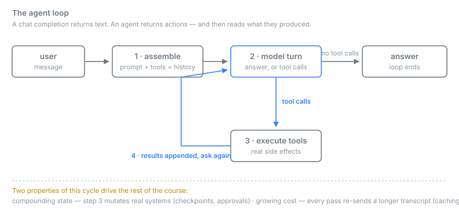

# Chapter 01 — Agent Foundations

> **Verified:** 2026-09-13 · Hermes Agent v0.21.2 (2026.9.11) · recheck: `python3 scripts/verify_chapters.py`

## Why this matters (job link)

Every "Senior Applied AI Engineer" posting assumes you can *operate* an autonomous agent,
not just chat with a model. Reflection's Forward Deployed Engineer posting: *"Build agentic
systems using state-of-the-art models, orchestrating LLM workflows... deploying reliable
production systems"* (`docs/research/jobs/source-04.md`). 100ms: *"Build, curate, and
maintain agentic workflows... define and implement LLM performance metrics"*
(`docs/research/jobs/source-05.md`). Databricks: *"Build features and run end-to-end
systems"* (`docs/research/jobs/source-02.md`). Before orchestrating agents you must
understand the machine: the agent loop, tools, toolsets, context injection, session state.
Everything in this course — cron, MCP, multi-agent, evals — is a modification of the loop
you learn here.

## Concepts

### The agent loop

A chat completion returns text; an agent returns *actions*. Hermes runs this loop:

1. **Assemble context.** System prompt (identity + rules) + skills index + memory +
   user profile + tool schemas + conversation history. Measure it: `hermes prompt-size`
   (Chapter 03 dissects every layer).
2. **Model turn.** The model either answers or emits tool calls.
3. **Tool execution.** Hermes runs the tool for real — shell commands, file writes, web
   requests — and returns the output to the model.
4. **Repeat until answer.** The model sees each result and decides again. One user message
   can drive dozens of tool calls.



Two properties of this loop matter for everything that follows:

- **Compounding state.** Tool calls mutate real systems (files, repos, servers). Mistakes
  compound exactly like code bugs — hence checkpoints and approvals (Chapters 04, 15).
- **Cost per loop iteration.** Every iteration re-sends context. Long loops on expensive
  models cost real money; prompt caching (Chapter 03) and routing (Chapter 02) exist
  because of this.

### Build it yourself — the loop is ~40 lines

Reading about the loop and having written one are different kinds of knowing, and the
second is what an interview probes. `examples/agent-loop/miniagent.py` is a complete agent
in ~120 lines of standard-library Python. Run it before you continue:

```bash
cd examples/agent-loop
python3 miniagent.py --demo     # scripted transcript: offline, no API key, no cost
```

Strip the file to its argument and this is all of it:

```python
messages = [{"role": "system", "content": SYSTEM},
            {"role": "user", "content": prompt}]

for step in range(1, max_steps + 1):
    message = transport(messages)          # ask the model
    messages.append(message)
    calls = message.get("tool_calls") or []
    if not calls:                          # no tool calls -> this is the answer
        return message["content"]
    for call in calls:                     # run what it asked for
        result = TOOLS[name](**args)       # ... and hand the result back
        messages.append({"role": "tool", "tool_call_id": call["id"],
                         "name": name, "content": result})
```

Four things in that fragment are the whole chapter:

1. **A tool result re-enters the conversation as a message.** The model does not "receive
   a return value"; it reads a transcript that now contains what happened. That is why an
   agent can reason about a failed command, and why Chapter 03's context budget is the
   binding constraint on everything.
2. **Termination is the model choosing to stop.** The loop ends when a turn comes back with
   no tool calls. Nothing else ends it — which is why `max_steps` is not optional. An agent
   without a cap is an unbounded bill with a plausible explanation attached.
3. **The transcript only grows.** Each pass re-sends everything before it plus the new
   results. Cost per iteration rises through the run; this is the mechanical reason caching
   (Chapter 03) and routing (Chapter 02) are cost levers rather than micro-optimisations.
4. **Tool errors are returned, not raised.** A hallucinated tool name becomes
   `error: no such tool 'send_email'. Available: ...` and the model recovers on the next
   turn. A traceback ends the run. This single choice is most of the difference between a
   loop that demos and a loop that finishes work.

The example also shows where containment has to live. `_safe()` refuses a path outside the
working directory, because the **model** chooses that argument and `../../.ssh/id_rsa` is a
normal-looking string. Prompting is not a security boundary; the tool is.

What `miniagent.py` deliberately omits is the map of the rest of this course: streaming,
retries and provider failover (Ch 02), context compression (Ch 03), approval gates (Ch 15),
persistence and checkpoints (Ch 04), cost accounting (Ch 14), delegation (Ch 09). Every one
is a modification of `run()`.

**The general pattern.** This loop is not Hermes'. It is the shape every tool-calling agent
has — LangGraph, an OpenAI Assistants run, a homegrown `while` loop — and interviews test it
at that level: what ends the loop, what happens when a tool fails, where the cost goes, and
where you put the guardrail. Hermes' contribution is not a different loop; it is everything
around it (gateway, scheduler, skills, memory). Knowing which is which is what lets you talk
to a team running something else.

### Toolsets, not just tools

Tools ship in groups (toolsets): `terminal`, `web`, `memory`, `browser`, `computer_use`,
platform-specific sets. Per-run selection is a flag:

```bash
hermes chat -q "..." -t terminal,web     # only these toolsets load
```

Fewer toolsets = smaller prompt, fewer distractions, lower cost. `hermes tools list`
(verified) shows every tool and its enabled state; MCP tools appear as `server:tool`
(Chapter 11).

### The three configuration surfaces

Memorize this split; violating it is the #1 beginner error:

| Surface | Path | Holds |
|---|---|---|
| Settings | `~/.hermes/config.yaml` | everything that is NOT a secret |
| Secrets | `~/.hermes/.env` | API keys, tokens only |
| Code | `~/.hermes/hermes-agent/` | the installed program |

Profiles (`~/.hermes/profiles/<name>/`) replicate this layout for isolated instances —
own config, own sessions, own memory (Chapters 04, 09).

### Sessions

One conversation = one session: own context, model, working directory. Sessions persist in
`~/.hermes/state.db` (SQLite + full-text search). A live store inspected for this chapter
(evidence b3): `21 sessions, 5972 messages, 29.5 MB` (2026-09-07 snapshot; your store will
differ) — CLI and Telegram sessions side by side in one store, resumable from any surface.

### What makes Hermes an *applied* platform

Three capabilities separate it from a chat app, and they organize this whole course:

1. **Skills** — agent-created procedure documents, loaded on demand (Chapter 10).
2. **Persistent memory** — identity and facts that survive sessions (Chapter 03).
3. **Gateway** — the same agent core serving 21+ messaging platforms, cron, webhooks
   (Chapters 06–08).

### Hermes vs the peer tools

Before choosing a tool, know the families that exist. Five well-known tools in this space
fall into two families (all quotes from official documentation, verified in
`docs/research/hermes/tool-landscape-evidence-2026-09-10.txt`):

| Tool | Family | Model access | Key point |
|---|---|---|---|
| Claude Code | Coding-agent CLI | Anthropic models; IDE/CLI also take third-party providers | terminal + IDE + desktop + web; GitHub/Slack ecosystem |
| Codex CLI | Coding-agent CLI | OpenAI models (ChatGPT plans) | open source, Rust; terminal-first |
| OpenCode | Coding-agent CLI | any provider (API key) | open source; TUI + desktop + IDE extension |
| Gemini CLI | Coding-agent CLI | Gemini models (Code Assist quotas) | open source; ReAct loop with MCP |
| OpenClaw | Gateway agent | any provider (API key) | self-hosted gateway on 10+ messaging platforms |
| Hermes | Gateway agent | 20+ providers; fallback chains and credential pools | gateway on 21+ platforms + built-in cron/webhooks |

The split between these two families is an architecture decision, not a marketing label:

- **Coding-agent CLIs** (Claude Code, Codex, OpenCode, Gemini CLI) are terminal-first and
  repo-centric: the best fit for code work inside one repository. Their automation story is
  mostly CI/CD integration or scheduled desktop tasks, not a built-in scheduler.
- **Gateway agents** (Hermes, OpenClaw) are a resident process that bridges messaging
  platforms to the agent core; sessions, cron, webhooks, and multi-agent routing are
  first-class citizens. Hermes's difference from OpenClaw is self-improvement depth:
  agent-created skills, persistent memory, and profile export (Chapters 03, 10, 13) versus
  static instruction files the user maintains (like `CLAUDE.md`).

A practical migration note: if a team already invested in Claude Code or Codex,
`hermes import-agent claude-code|codex` (verified, Chapter 13) imports that setup into
Hermes in one command. When a coding agent alone is enough, the simple test is: work
inside one repo → coding-agent CLI; work on the real machine, from messaging, with
scheduled automation → gateway agent.

### The subcommand map

`hermes --help` exposes 73 subcommands on v0.21.2 (the top-level parser's own choices
list — reproduce it with `hermes --help`). You do not memorize them; you navigate by group:

- **Core:** `chat`, `model`, `moa`, `fallback`, `config`, `doctor`, `status`, `migrate`
- **Sessions/data:** `sessions`, `checkpoints`, `backup`, `insights`
- **Automation:** `cron`, `webhook`, `hooks`, `send`, `gateway`
- **Multi-agent:** `kanban`, `peer`, `delegate` (in-session), `profile`, `project`
- **Extension:** `skills`, `bundles`, `sync`, `plugins`, `mcp`, `serve`, `acp`, `proxy`
- **Security:** `security`, `approvals`, `secrets`, `egress`, `auth`, `vault`, `portal`
- **Operations:** `pause`/`resume` (global stop), `verify`, `logs`, `debug`, `dump`,
  `console`

Each group gets its own chapter(s) ahead.

Two of these are worth knowing on day one even though their chapter is far off. `hermes
pause` is the global emergency stop — it halts *new* cron dispatch, kanban dispatch, and
gateway turns while leaving in-flight work alone, and `hermes resume` lifts it. `hermes
dump` prints a copy-pasteable summary of your setup, which is what you attach when you ask
for help. Both are verified in
`docs/research/hermes/cli-evidence-2026-09-13-v0.21.2-surface.txt`.

**Evidence for this chapter:** `docs/research/hermes/cli-evidence-2026-09-07.txt`,
`docs/research/hermes/cli-evidence-2026-09-07-b1-foundations-core.txt`,
`docs/research/hermes/cli-evidence-2026-09-07-b3-sessions-tools.txt` (raw CLI outputs on a
live store, captured against v0.20.6) and
`docs/research/hermes/cli-evidence-2026-09-13-v0.21.2-surface.txt` (the v0.21.2
re-verification pass: `--help` surfaces only, no machine state).

## Verified commands

Build and run the loop from scratch before running the real one — it costs nothing and
it is the fastest way to understand what `hermes chat` is doing:

```bash
cd examples/agent-loop
python3 miniagent.py --demo           # scripted: watch the trajectory, no API key
python3 -m unittest discover -s ../../tests -k agent_loop
```

Install (Linux/macOS/WSL2):

```bash
curl -fsSL https://hermes-agent.nousresearch.com/install.sh | bash
```

Health check and interactive setup — `hermes doctor` verified rendering a component
health panel (evidence b7):

```bash
hermes doctor        # component-by-component health check
hermes setup         # interactive wizard: provider, keys, platform
hermes status        # component status summary (--all for detail)
```

First conversation — three modes, verified:

```bash
hermes               # interactive chat (default surface)
hermes chat -q "What is 17*23?"    # one-shot: answers, exits — no slash commands
hermes chat -q "Count files here, report the largest" -t terminal
                     # restricted toolset run — watch the tool call happen
```

The `--help` tree (verified excerpt):

```
usage: hermes [-h] [--version] [-z PROMPT] [-m MODEL] [--provider PROVIDER]
              [-t TOOLSETS] [--resume SESSION] [--continue [SESSION_NAME]]
              [--worktree] [--skills SKILLS] [--safe-mode] [--tui] [--cli] ...
{chat,model,moa,fallback,worktree,browser,secrets,egress,migrate,gateway,
 proxy,lsp,setup,send,login,logout,auth,status,pause,resume,cron,sync,
 webhook,peer,portal,kanban,project,hooks,doctor,verify,security,approvals,
 dump,debug,backup,checkpoints,import,config,console,skills,bundles,plugins,
 curator,memory,tools,computer-use,mcp,sessions,insights,monitoring,vault,
 update,acp,profile,dashboard,serve,desktop,logs,prompt-size, ...}
```

Model selection and identity:

```bash
hermes model                # interactive provider+model picker
hermes config get model     # verified live output:
# default: minimax/minimax-m3:free
# provider: openrouter
# aliases: gemini-pro, gemini-flash, vertex-pro, vertex-flash ...
hermes --version
# Hermes Agent v0.21.2 (2026.9.11) · upstream 422bc9bd
```

## Common pitfalls

- **Secrets in config.yaml.** Keys belong in `~/.hermes/.env` only. Mixing them leaks
  credentials into `hermes backup` archives and screenshots.
- **Treating Hermes as a chatbot.** Chat-only use pays agent costs for chatbot value.
  The leverage is tool access — always think "which toolset does this task need?"
- **Skipping `hermes doctor` after install.** A broken provider key or missing optional
  dependency surfaces there, not at first real use.
- **Reading about the loop instead of writing one.** The concepts in this chapter are
  forty lines of code. `examples/agent-loop/miniagent.py --demo` takes a minute and makes
  every later chapter land differently.
- **Assuming the agent stops on its own.** Termination is the model declining to call a
  tool. There is no other exit; a step budget is a requirement, not a tuning knob.
- **Treating the system prompt as a security boundary.** The model picks tool arguments.
  Containment belongs in the tool, where it cannot be argued with — see `_safe()` in the
  example, and Chapter 15 for the real thing.
- **One-shot vs interactive confusion.** `hermes chat -q` exits after answering and has
  no slash commands; interactive `hermes` supports `/model`, `/skills`, `/new`.
- **Confusing the tool families.** Comparing Hermes to Claude Code as "which is better" is
  meaningless; they are different families (coding-agent CLI vs gateway agent). The right
  question: is your work repo-centric or machine-and-messaging-centric? The comparison
  table is in Concepts; evidence in
  `docs/research/hermes/tool-landscape-evidence-2026-09-10.txt`.
- **Piping interactive UIs.** Verified: `hermes tools` (config UI) refuses non-TTY stdin —
  "requires an interactive terminal". Scripts use `hermes tools list/enable/disable`.
- **Ignoring `-t` toolset scoping.** Loading every toolset for a trivial question wastes
  prompt budget and invites wrong-tool calls.

## Exercises

Work through `exercises/ex01-agent-foundations.md`. Verification: `hermes doctor` clean,
one tool-using run observed and explained in loop terms, three config surfaces located,
model identity confirmed, and one peer tool from the "Hermes vs the peer tools" table
picked and its family stated in one sentence.

### Senior interview probes

"Implement a minimal agent loop" is one of the most common live exercises for this role.
These are the follow-up questions, and the exercise has you answer them from code you wrote
rather than from memory:

1. Write the agent loop on a whiteboard. What is the exit condition, and what happens if
   the model never satisfies it?
2. A tool raises an exception mid-run. Walk through two designs — propagate, or return the
   error as the tool result — and say which you ship and why.
3. Why does the cost of a single user request grow superlinearly with the number of tool
   calls it triggers?
4. The model asks to read `../../.ssh/id_rsa`. Where do you stop it, and why is "tell it not
   to in the system prompt" the wrong answer?
5. The model emits a call to a tool you never defined. What does your loop do?
6. How would you test an agent loop without a model, a key, or a network? What does that
   force you to change about its design?
7. What is the difference between a toolset and a tool, and what does the distinction buy
   you at runtime?
8. Where would you add streaming, retries, and an approval gate to the loop you just wrote,
   and which of the three changes the loop's control flow?
